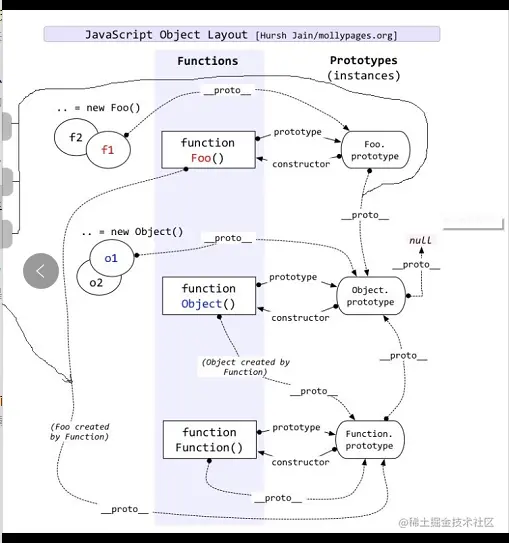

## 概念
* prototype：每个函数都有的属性，指向被称为“函数原型”的对象
* \_\_proto\_\_：每个对象都有的隐式原型
```js
function Foo()={}
let a = new Foo;
console.log(a.__proto__ === Foo.prototype); // true
//a.__proto__ 指向 Foo.prototype
```
* constructor：原型指向构造函数的属性  

## 原型链
> 实例对象在查找属性时，如果查找不到，就会沿着`__proto__`去与对象关联的原型上查找，如果还查找不到，就去找原型的原型，直至查到最顶层。  


## [new](https://developer.mozilla.org/zh-CN/docs/Web/JavaScript/Reference/Operators/new)
```js
function Car(make, model, year) {
  this.make = make;
  this.model = model;
  this.year = year;
  return 'this is a car'
}

const car1 = new Car('Eagle', 'Talon TSi', 1993);

console.log(car1.make);//Eagle
console.log(Car())//this is a car
```