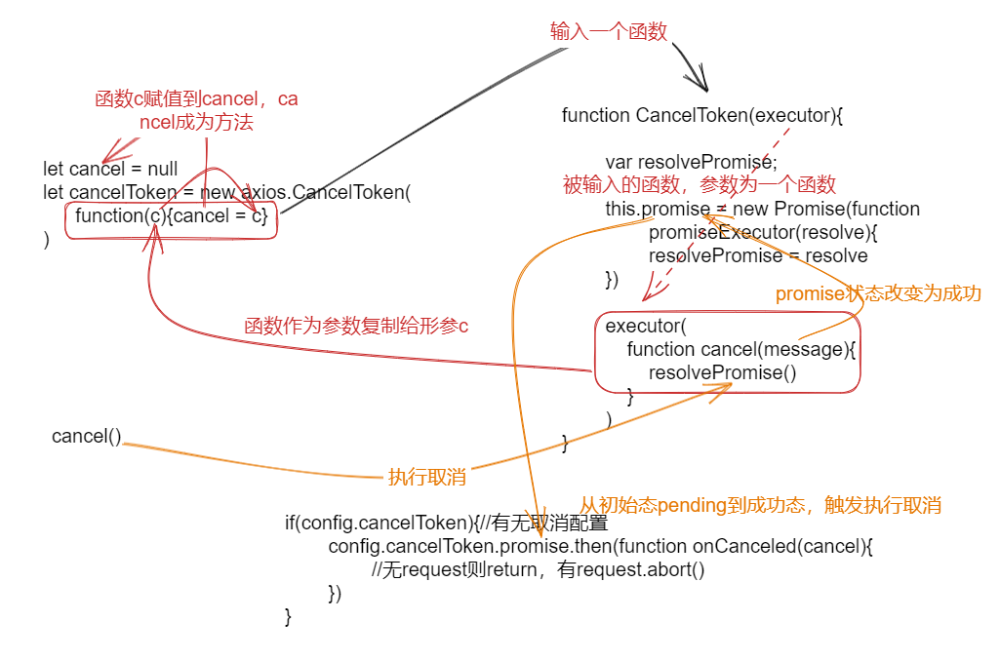

## ajax，xml，xhr
* Ajax即Asynchronous Javascript And XML（异步JavaScript和XML），对xhr的封装
* XML: 可扩展标记语言 (Extensible Markup Language）
* XHR（XMLHttpRequest）: 是浏览器提供的 JavaScript对象
* axios是通过Promise实现对ajax技术的一种封装

## 创建
1. axios = createInstance(default)：创建对象
* createInstance
```js
//axios.js
createInstance(defaultConfig){
	//实例化
	var context = new Axios(defaultConfig)
	//复制request方法到instance
	var instance = bind(Axios.prototype.request,context)
	//复制原型方法到instance
	utils.extend(instance,Axios.prototype,context)
	//axios对象属性复制到instance
	utils.extend(instance,context)
	return instance
	//instance是函数，可以当函数用 axios({})
	//也可以当对象调用方法使用  axios.get()
}

//Axios.js
Axios(defaultConfig){
	this.defaluts = defaultConfig
	//添加拦截器
	this.interceptors = {
		request:new InterceptorManager(),
		response:new InterceptorManager()
	}
}
//原型添加方法
Axios.prototype.request=function{}
Axios.prototype[method]=function{}
//...
```
1. axios.Axios = Axios 、axios.create=function{...}：对象添加属性、方法
2. axios.Cancel、axios.CancelToken、axios.isCancel：对象添加取消属性、方法
3. 暴露axios


## 发送
```js
//Axios.js
Axios.prototype.request = function request(config){
	//config 有效性
	//config合并
	//方法
	//拦截中间件
	var chain [dispatchRequest 发送请求函数,undefined]
	//创建成功promise 合并配置
	var promise = Promise.resolve(config)
	//拦截器部分
	//...
	//...
	
	while(chain.length){
		//promise成功，所以固定执行第一个dispatchRequest函数
		promise = promise.then(chain.shift(),chain.shift())
	}
	return promise
}


//dispatchRequest.js
dispatchRequest(config){
	//抛出请求取消错误
	//配置请求头
	//请求体/头初始化
	//合并配置
	//移除头配置中方法配置
	//获取适配器对象
	//发送请求
	return adapter(config)/*xhr封装*/.then(function{
		//请求完成后处理方法，return一个对象，所以是成功promise
	})
}
```

## 拦截
```js
// 使用
//use:new InterceptorManager()上的方法
axios.interceptors.request.use((config)=>{
	console.log('请求拦截器1--成功')
}，(error)=>{
	console.log('请求拦截器1--失败')
})
//请求拦截器2
axios.interceptors.response.use((response)=>{
	console.log('响应拦截器1--成功')
}，(reason)=>{
	console.log('响应拦截器1--失败')
})
//响应拦截器2

//运行结果：请求2，请求1，响应1，响应2
```

```js
// interceptorManager.js
function InterceptorManager(){
	//监听队列
	this.handlers = []
}
InterceptorManager.prototype.use = function use(fulilled,rejected){
	//压入
	this.handlers.push({
		fulilled,
		rejected,
	})
}
//this.handler中拦截器顺序：请求1，请求2

//Axios.js
Axios.prototype.request = function request(config){
	//...
	var chain [dispatchRequest 发送请求函数,undefined]
	//创建成功promise 合并配置
	var promise = Promise.resolve(config)
	//拦截器部分
	this.interceptors.request.forEach(function 将请求拦截器顺序压入chain最前面{})
	//this.interceptors中拦截器顺序：请求2，请求1，handler中在前的先压入
	this.interceptors.response.forEach(function 将响应拦截器顺序压入chain最后面{})
	//this.interceptors中拦截器顺序：请求2，请求1，响应1，响应2，handler中在前的先压入
	
	while(chain.length){
		//promise成功，所以固定执行第一个dispatchRequest函数
		promise = promise.then(chain.shift(),chain.shift())
	}
	return promise
}
```
## 取消
```js
//使用
	let cancel = null
	let cancelToken = new axios.CancelToken(function(c){
			cancel = c
		})
		
	if(cancel !== null){
		cancel()//取消发送
	}
	
	axios({
		method,url,cancelToken
	}).then(res=>{cancel = null})
	
```

```js
//CancelToken.js
function CancelToken(executor){
	//executor必须为函数 判定
	//声明变量
	var resolvePromise;
	//实例添加promise属性
	this.promise = new Promise(function promiseExecutor(resolve){
		//将修改promise对象状态的参数暴露
		resolvePromise = resolve
	})
	//此时，执行resolvePromise() ,this.promise将变为成功状态
	//token 指向当前实例
	var token = this
	executor(function cancel(message){
		if(token.reason){return}
		token.reason = new Cancel(message);
		resolvePromise(token.reason)
	})
}

//xhr.js
if(config.cancelToken){//有无取消配置
	config.cancelToken.promise.then(function onCanceled(cancel){
		//无request则return，有request.abort()
	})
}
```
