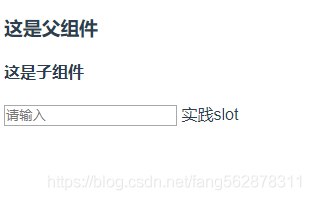
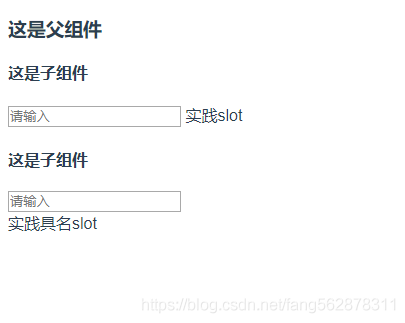
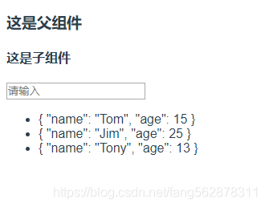

##### 默认插槽

```html
<!--slot-->
<!--father-->
  <div>
    <h3>这是父组件</h3>
    <son>实践slot</son>
  </div>
<!--son-->
  <div>
    <h4>这是子组件</h4>
    <input type="text" placeholder="请输入">
    <slot></slot>
  </div>
```

##### 具名插槽
```html
<!--具名插槽-->
<!--father-->
  <div>
    <h3>这是父组件</h3>
    <son>
       <template slot="myslot">
          <div>实践具名slot</div>
       </template>
    </son>
  </div>
<!--son-->
  <div>
    <h4>这是子组件</h4>
    <input type="text" placeholder="请输入">
    <slot></slot>
    <slot name="myslot"></slot>lot>
  </div>
```

##### 作用域插槽
```html
<!--作用域插槽-->
<!--father-->
  <div>
    <h3>这是父组件</h3>
    <son>
     <template slot="myslot" slot-scope="scope">
        <ul>
          <li v-for="item in scope.data">{{item}}</li>
        </ul>
      </template>
    </son>
  </div>
<!--son-->
  <div>
    <h4>这是子组件</h4>
    <input type="text" placeholder="请输入">
    <slot name="myslot"  :data='list'></slot>lot>
  </div>

<scrip>
//拥有数据list
</scrip>
```
