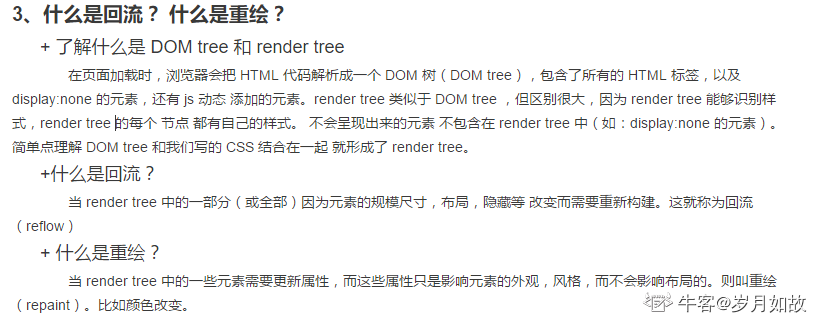

##### CDN
* Content Delivery Network，内容分发网络
* 缓存服务器
* 源服务器备份静态文件至CDN->用户请求CDN静态文件->CDN任播均衡负载，选择最近CDN返回
##### 懒加载
需要的时候加载对应的页面资源，而不是把所有的页面资源打包部署到一块。
##### 其他
* 雪碧图
* base64（_Base64_编码是从二进制到字符的过程，可用于在HTTP环境下传递较长的标识信息_）
* js 脚本放在页面底部或者使用 defer（所有元素解析完成后执行） 或 async（加载完了就会立刻执行） 属性。（无脑使用defer）

### 垃圾回收
* 世代假说：一是新生的对象容易早死，另一个是不死的对象会活得更久
* 分代回收机制，分为新生代和老生代
* 在新生代空间中，内存空间分为两部分，分别为 From 空间和 To 空间。当 From 空间满了的时候会执行 Scavenge 算法进行垃圾回收
* Scavenge：1、检查 From 空间的存活对象，死了释放  2、对象存活，将满足的条件的晋升老生代  3、不满足晋升条件则移动 To 空间  4、最后将 From 空间和 To 空间角色进行交换
* 晋升条件：已经经过一次 Scavenge 回收；To 空间的内存使用占比是否超过限制，若空间使用超过 25%，则直接晋升

##### 重绘回流
* 
##### 白屏时间first paint和可交互时间dom ready
* 白屏时间（first Paint Time）——用户从打开页面开始到页面开始有东西呈现为止
* 首屏时间——用户浏览器首屏内所有内容都呈现出来所花费的时间
* 用户可操作时间(dom Interactive)——用户可以进行正常的点击、输入等操作，默认可以统计domready时间