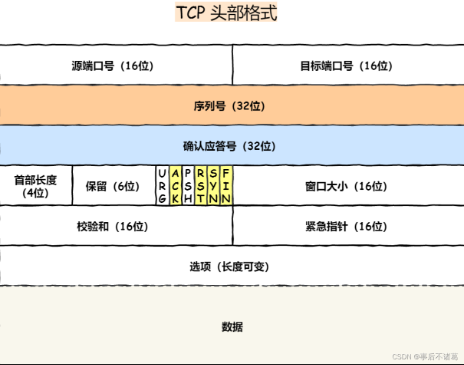
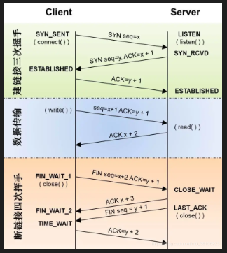
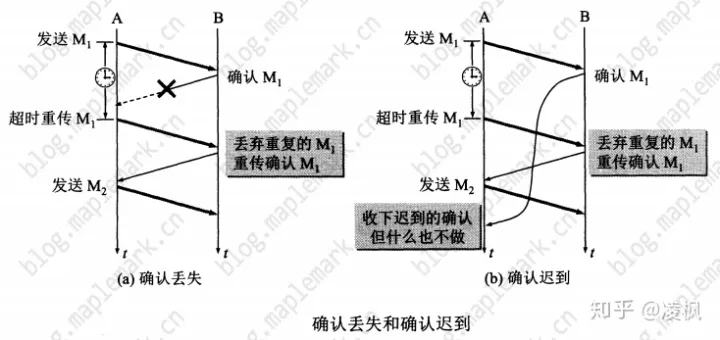
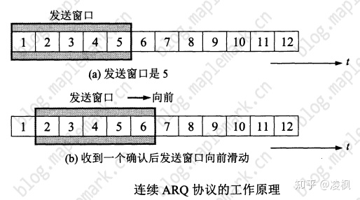
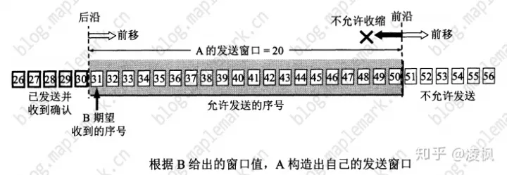
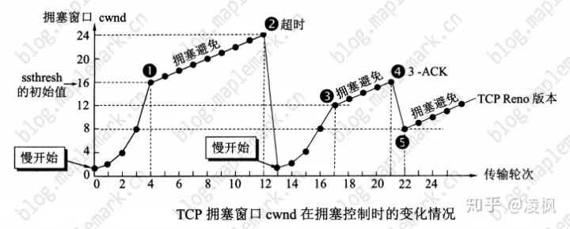

## 特性
* 面向连接`（一对一连接）`的、可靠的`（保证一个报文一定能够到达接收端）`、基于字节流`（没有边界,无论大小,有序）`的传输层通信协议
* 分片，确认到达，超时重发，滑动窗口（连续ARQ）,拥塞避免

## 报文格式

## 三次握手、四次挥手

>**第1次握手**：客户端发送一个带有SYN（synchronize）标志的数据包给服务端；  
>**第2次握手**：服务端接收成功后，回传一个带有SYN/ACK标志的数据包传递确认信息，表示我收到了；  
>**第3次握手**：客户端再回传一个带有ACK标志的数据包，表示我知道了，握手结束。  
---
>**第1次挥手**：客户端发送一个FIN，用来关闭客户端到服务端的数据传送，客户端进入FIN_WAIT_1状态；  
>**第2次挥手**：服务端收到FIN后，发送一个ACK给客户端，确认序号为收到序号+1（与SYN相同，一个FIN占用一个序号），服务端进入CLOSE_WAIT状态；  
>**第3次挥手**：服务端发送一个FIN，用来关闭服务端到客户端的数据传送，服务端进入LAST_ACK状态；  
>**第4次挥手**：客户端收到FIN后，客户端t进入TIME_WAIT状态，接着发送一个ACK给Server，确认序号为收到序号+1，服务端进入CLOSED状态，完成四次挥手。

## 确认到达

## 连续ARQ、滑动窗口

## 拥塞避免
