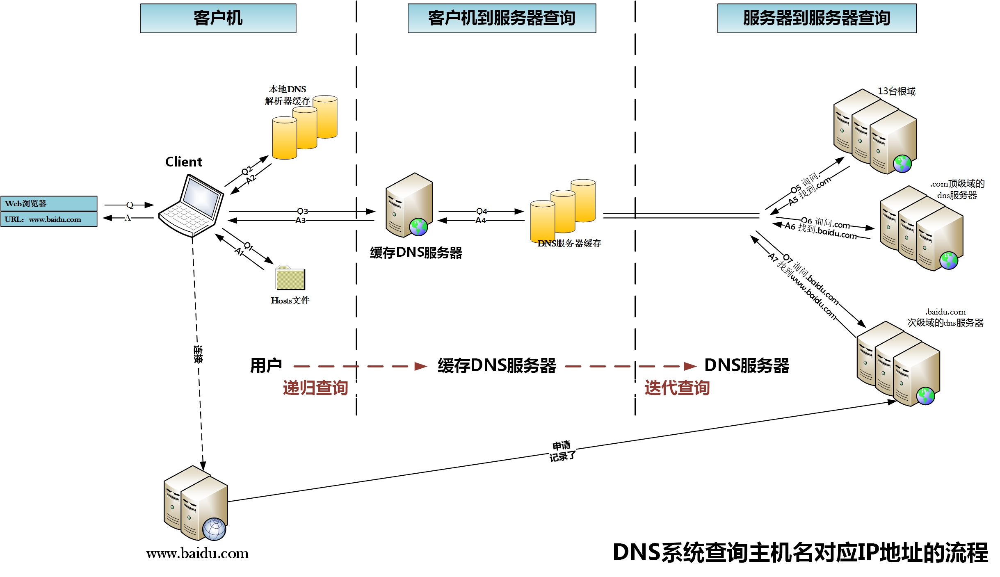

## 输入网址
1. 浏览器预检查：url格式、https等
2. DNS解析
3. 建立TCP
4. HTTP/HTTPS
5. 解析html、请求html资源
6. 渲染
* [30分钟弄懂浏览器历史与渲染基本流程 / 浏览器工作原理入门教程】 【精准空降到 14:21](https://www.bilibili.com/video/BV1tc41157Va/?share_source=copy_web&vd_source=0712b304bc9ec06613c7898e9ccd8182&t=861)

## DNS
* Domain Name System域名系统
* 主机名到 IP 地址的转换服务
* **DNS占用53号端口，同时使用TCP和UDP协议。**

## CDN

## 固定端口
- ssh: 22
- ftp: 21
- http/ws: 80
- https/wss：443
- dns: 53
- TCP：23